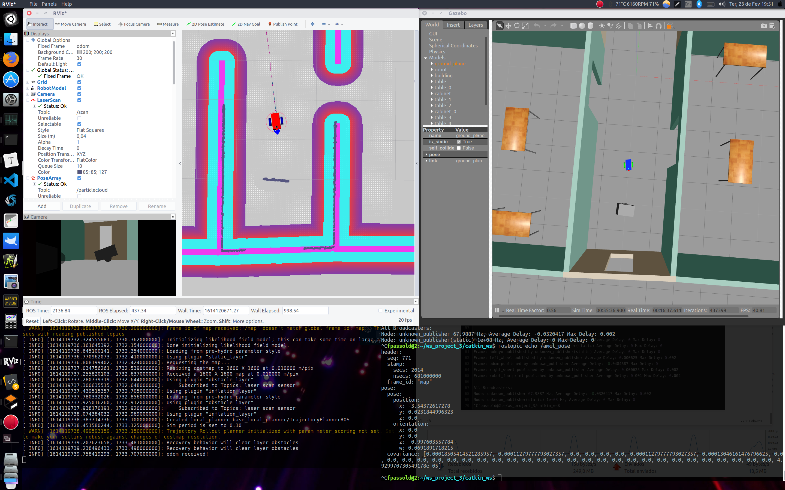
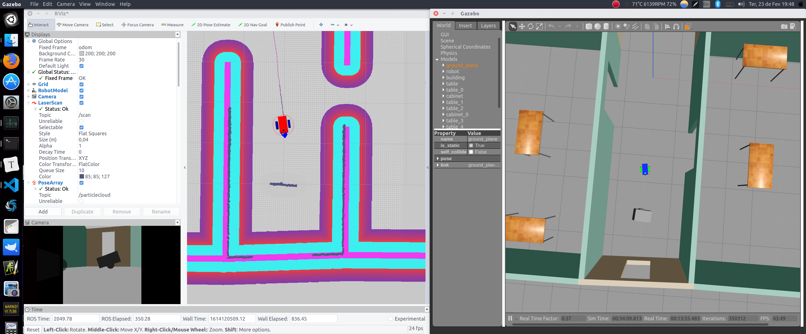

# Where am I - Latest version

Where Am I Project - Latest Update (AMCL algorithm better tuned)

## AMCL algorithm better tuned

New release, this version continues to use the original 4 parameter settings files:

* `base_local_planner_params.yaml`;
* `constmap_common_params.yaml`;
* `global_costmap_params.yaml` and
* `local_costmap_params.yaml`

but another config file was added:

* `amcl_params.yaml`.

Old parameters have been modified and others added based on:

* [ROS Navigation Tuning Guide](http://kaiyuzheng.me/documents/navguide.pdf), Kaiyu Zheng, September 2, 2016;
* [ROS Wiki: amcl](http://wiki.ros.org/amcl);
* [ROS users: Navigation stack not working](http://ros-users.122217.n3.nabble.com/Navigation-stack-not-working-td1519053.html);
* [Rviz 'base map' at a different initial position compared to Gazebo world](https://answers.ros.org/question/348045/rviz-base-map-at-a-different-initial-position-compared-to-gazebo-world/);
* [How to get robot position (x,y) in a map?](https://question3156.rssing.com/chan-47151998/article5-live.html);
* [[ROS Q&A] 200 - How to set the initial pose in ROS Navigation programatically](https://youtu.be/-81TEdn6qLU), The Construct, 13 mar 2020.

### Covariance values after moving the robot:

```bash
fpassold@2:~/ws_project_3/catkin_ws$ rostopic echo /amcl_pose
header: 
  seq: 771
  stamp: 
    secs: 2014
    nsecs: 681000000
  frame_id: "map"
pose: 
  pose: 
    position: 
      x: -3.54372617278
      y: 0.0231844996323
      z: 0.0
    orientation: 
      x: 0.0
      y: 0.0
      z: -0.997603557784
      w: 0.0691891718215
  covariance: [0.00018505414521285957, 0.00011279777793027357, 0.0, 0.0, 0.0, 0.0, 0.00011279777793027357, 0.00013046161476796625, 0.0, 0.0, 0.0, 0.0, 0.0, 0.0, 0.0, 0.0, 0.0, 0.0, 0.0, 0.0, 0.0, 0.0, 0.0, 0.0, 0.0, 0.0, 0.0, 0.0, 0.0, 0.0, 0.0, 0.0, 0.0, 0.0, 0.0, 4.929970730549178e-05]
---
^Cfpassold@2:~/ws_project_3/catkin_ws$ 
```

### Some files:

* `amcl.launch`:

```xml
<launch>
  <!-- 6) Map Server Node 1 `name="map_server"`; -->
  <!-- O nó map_server fornece dados de mapa como um serviço ROS para outros nós, como o nó amcl. 
       Aqui, o nó map_server localizará o mapa que você criou na etapa Map Setup 
       e o enviará como os dados do mapa. -->
  <!-- First, add an argument of the path to your map file -->
  <!-- <arg name="map_file" default="$(find <YOUR PACKAGE NAME>)/maps/<YOUR MAP NAME>.yaml"/> -->
  <arg name="map_file" default="$(find my_robot)/maps/map.yaml"/>
  <!-- Then, add the `map_server` node, which utilizes the argument you created just now: -->
  <!-- <node name="map_server" pkg="map_server" type="map_server" args="$(arg map_file)" /> -->
  <node name="map_server" pkg="map_server" type="map_server" args="$(arg map_file)">
    <param name="frame_id" value="/map"/> 
  </node>

  <!-- 7) AMCL Node `name="amcl"`; -->
  <!-- AMCL Node -->
  <node name="amcl" pkg="amcl" type="amcl" output="screen">
    <!-- <remap from="scan" to="<YOUR PACKAGE NAME>/laser/scan"/> -->
    <!-- what are the sensor readings from the LiDAR? -->
    <!-- <remap from="scan" to="my_robot/laser/scan"/> --> 
    <remap from="scan" to="/scan"/>
    <!--  parameters in order to connect the world (`map` frame) with the robot (`odom` frame). -->
    <param name="odom_frame_id" value="odom"/>
    <param name="odom_model_type" value="diff-corrected"/>
    <param name="base_frame_id" value="robot_footprint"/>
    <param name="global_frame_id" value="map"/>
    <!-- Lembre-se de que o pacote AMCL 'liga' o robô (frame `odom`) ao mundo (frame `map`) !?
         Esses parâmetros são necessários para o pacote amcl localizar o robô no mundo.-->
    <!-- Optional: Set Initial Position -->
    <param name="initial_pose_x" value="0"/>
    <param name="initial_pose_y" value="0"/>
    <!-- Config parameters created in another folder to "clean" launch file -->
    <!-- Fernando, on 19/02/2021-->
    <rosparam file="$(find my_robot)/config/amcl_params.yaml" command="load" />    
  </node>

  <!--8) Move Base Node `name="move_base"` -->
  <node name="move_base" pkg="move_base" type="move_base" respawn="false" output="screen">
    <!-- Again, we need to `remap` the `scan` topic to the correct one. -->
    <!-- <remap from="scan" to="my_robot/laser/scan"/> --> 
    <remap from="scan" to="/scan"/>
    <!-- Adding Parameters to `move_base` (robot) in the world Node -->
    <!--  when there are plenty of parameters, we could use the rosparam tag to include config files to set multiple parameters directly!  -->
    <!-- Planners: -->  
    <param name="base_global_planner" value="navfn/NavfnROS" />
    <param name="base_local_planner" value="base_local_planner/TrajectoryPlannerROS"/>
    <!-- Config files, em outra pasta! -->
    <rosparam file="$(find my_robot)/config/costmap_common_params.yaml" command="load" ns="global_costmap" />
    <rosparam file="$(find my_robot)/config/costmap_common_params.yaml" command="load" ns="local_costmap" />
    <rosparam file="$(find my_robot)/config/local_costmap_params.yaml" command="load" />
    <rosparam file="$(find my_robot)/config/global_costmap_params.yaml" command="load" />
    <rosparam file="$(find my_robot)/config/base_local_planner_params.yaml" command="load" />
  </node>

</launch>
```

* `amcl_params.yaml`:

```yaml
# Ref.: http://wiki.ros.org/amcl and
# http://kaiyuzheng.me/documents/navguide.pdf

# Optional: Set Initial Position
# initial_pose_x: 0.0
# initial_pose_y: 0.0
# initial_pose_a: # initial rotation angle

first_map_only: false # When set to true, AMCL will only use the first map it subscribes to, rather than updating each time a new one is received. (defalt=false)

# number of particles chosen not to overload CPU
min_particles: 25  # default: 100
max_particles: 200 # default: 5000

# Laser model parameters <-- adding noise improves location
laser_z_hit:     0.9 # Mixture weight for the z_hit part of the model, default: 0.95
laser_sigma_hit: 0.1 # Standard deviation for Gaussian model used in z_hit part of the model, default: 0.2 meters
laser_z_rand:    0.5 # Mixture weight for the z_rand part of the model, default: 0.05
laser_likelihood_max_dist: 2.0 # 4.0 # Maximum distance to do obstacle inflation on map, for use in likelihood_field model, default: 2.0 meters

# Odometry model parameters <-- reducing noise
kld_err: 0.01 # Maximum error between the true distribution and the estimated distribution, default: 0.01
kld_z:   0.99 # Upper standard normal quantile for (1 - p), where p is the probability that the error on the estimated distrubition will be less than kld_err, default: 0.99
odom_alpha1: 0.005 # expected noise in odometry's rotation estimate from the rotational component of the robot's motion, default: 0.2
odom_alpha2: 0.005 # expected noise in odometry's rotation estimate from translational component of the robot's motion,  default: 0.2
odom_alpha3: 0.005 # expected noise in odometry's translation estimate from the translational component of the robot's motion, default: 0.2
odom_alpha4: 0.005 # expected noise in odometry's translation estimate from the rotational component of the robot's motion, default: 0.2

update_min_a: 0.02 # Rotational movement required before performing a filter update. (default=PI/6)
update_min_d: 0.02 # Translational movement required before performing a filter update. (default=0.2)
resample_interval: 2 # Number of filter updates required before resampling. (Default=2)
save_pose_rate: 0.1  # Maximum rate (Hz) at which to store the last estimated pose and covariance to the parameter server, in the variables ~initial_pose_* and ~initial_cov_*. This saved pose will be used on subsequent runs to initialize the filter. -1.0 to disable. (default=0.5)
first_map_only: false # When set to true, AMCL will only use the first map it subscribes to, rather than updating each time a new one is received. (defalt=false)
```

* `base_local_planner_params.yaml`:

```yaml
controller_frequency: 10

TrajectoryPlannerROS:
  max_vel_x:      1.5 # 0.5
  min_vel_x:      0.1 # 0.01 # original Udacity value = -0.1 (negative !?)
  max_vel_theta:  1.57 #1.5

  min_in_place_vel_theta: 0.261799 # 15 degress # 18 degrees=0.314

  acc_lim_theta: 3.14
  acc_lim_x: 2.0
  acc_lim_y: 2.0

  sim_time: 1.0 # original Udacity value, but...
  # http://kaiyuzheng.me/documents/navguide.pdf recommendations bellow:
  # sim_time: 2.0 # low value, limited performance, difficulties to pass narrow spaces
  # sim_time: 4.0 # 2.0 # 4.0 # 1.0 # time interval for DWA planner. 4.0 = typical value
  # sim_time: 5.0 # long curver, not very flexible, heavier computational load  

  vx_samples:      5.0 # original Udacity value=5.0
  vtheta_samples: 10.0

  pdist_scale:   0.6 #0.6
  gdist_scale:   0.8 #0.8
  occdist_scale: 0.02

  holonomic_robot: false
```

* `costmap_common_params.yaml`:

```yaml
map_type: costmap

obstacle_range: 1.5 # 5.0 # 2.0 # 1.0=original Udacity
raytrace_range: 3.0 # 7.0 # 3.0 # 2.0 # 2.0=original Udacity

transform_tolerance: 0.25 # 0.1 # 0.2=original Udacity # 0.0 # Time with which to post-date the transform that is published, to indicate that this transform is valid into the future, default: 0.1 seconds

robot_radius:        0.25 # 0.3
inflation_radius:    0.55 # 0.2# 0.5=original Udacity
cost_scaling_factor: 2.9  # 5.0=original Udacity

observation_sources: laser_scan_sensor

# laser_scan_sensor: {sensor_frame: hokuyo, data_type: LaserScan, topic: /my_robot/laser/scan, marking: true, clearing: true}
# Atualizado em 15.02.2021 - 'my_robot.gazebo' file makes reference to: "<topicName>/scan</topicName>"
laser_scan_sensor: {sensor_frame: hokuyo, data_type: LaserScan, topic: /scan, marking: true, clearing: true}
```

* `global_costmap_params.yaml`:

```yaml
global_costmap:
   global_frame: map
   robot_base_frame: robot_footprint
   update_frequency:  3.0 # 2.0=original Udacity // overload processing, warnings, 
   # higher values cause the map to be updated more frequently. default = 5.0
   # On that particular point, older versions of amcl had a very
   # inefficient procedure for pre-computing the likelihood field model for the laser. 
   # It could take tens of seconds to run on large maps.
   # Ref.: http://ros-users.122217.n3.nabble.com/Navigation-stack-not-working-td1519053.html
   # definir update_frequency mais baixo afetará a frequência com que os obstáculos 
   # são colocados no mapa de custos. Com uma configuração de 1,0 Hz, isso significa que 
   # você só receberá novas informações de obstáculo uma vez por segundo, o que pode ser 
   # problemático dependendo de quais obstáculos dinâmicos existem em seu ambiente. 
   publish_frequency: 0.0 # 2.0=original Udacity # this value can be lowered to zero.
   width:  16.0 # 20.0
   height: 16.0 # 20.0
   resolution: 0.05 # 0.02
   static_map: true
   rolling_window: false
```

* `local_costmap_params.yaml`:

```yaml
local_costmap:
   global_frame: odom
   robot_base_frame: robot_footprint
   update_frequency: 5.0 # 2.0 # default value = 5.0
   # On that particular point, older versions of amcl had a very
   # inefficient procedure for pre-computing the likelihood field model for the laser. 
   # It could take tens of seconds to run on large maps.
   # Ref.: http://ros-users.122217.n3.nabble.com/Navigation-stack-not-working-td1519053.html
   # definir update_frequency mais baixo afetará a frequência com que os obstáculos 
   # são colocados no mapa de custos. Com uma configuração de 1,0 Hz, isso significa que 
   # você só receberá novas informações de obstáculo uma vez por segundo, o que pode ser 
   # problemático dependendo de quais obstáculos dinâmicos existem em seu ambiente. 
   publish_frequency: 0.0 # default value = 2.0 # 5.0=original Udacity # this value can be lowered to zero.
   width: 6.0
   height: 6.0
   resolution: 0.05
   static_map: false
   rolling_window: true
```

Video available at: [Youube: Where Am I](https://youtu.be/rGd4agj_UdE)



---

Fernando Passold, 23/02/2021
